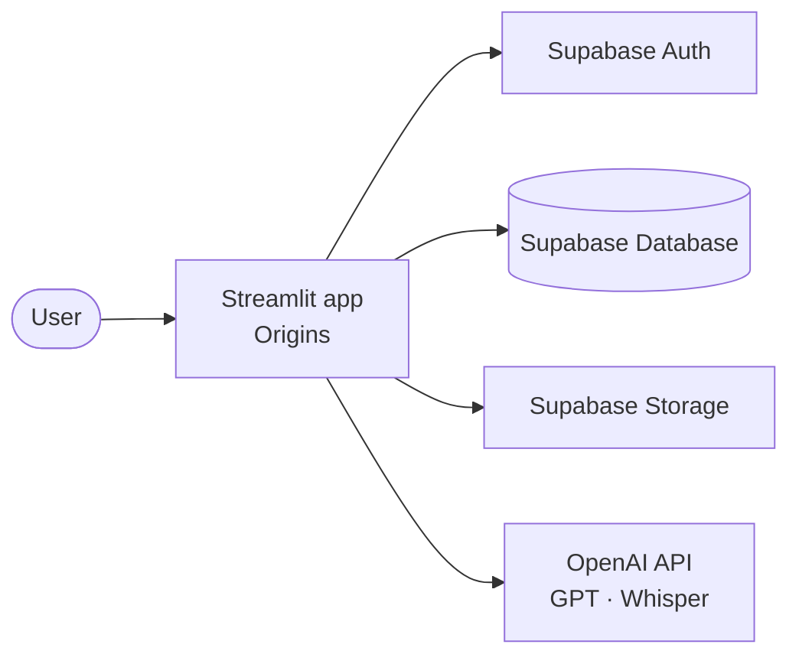

# Architecture (Gate 1 app)

This folder holds the **Check-in 1 / Gate 1** Streamlit scaffold for the **Origins** product (see repo root `ARCHITECTURE.md` for the full technical document).

## Overview

Origins is a Streamlit multi-page application. Users authenticate via Supabase Auth. Story data and media metadata live in Supabase Postgres; media files use Supabase Storage. The AI interview flow will call OpenAI (GPT for question generation and dialogue, Whisper for speech-to-text).

## System context (C4 Level 1)

At context level, the user interacts with one system (the Streamlit app). That app integrates with Supabase for identity and data, and OpenAI for the interview and transcription features.

- **User → Streamlit app:** browser UI (login, interview, timeline, story detail).
- **Streamlit app → Supabase Auth / Database / Storage:** sessions and signup/login; `persons` and `stories`; photos and audio files.
- **Streamlit app → OpenAI API:** GPT for interview questions; Whisper for speech-to-text.
